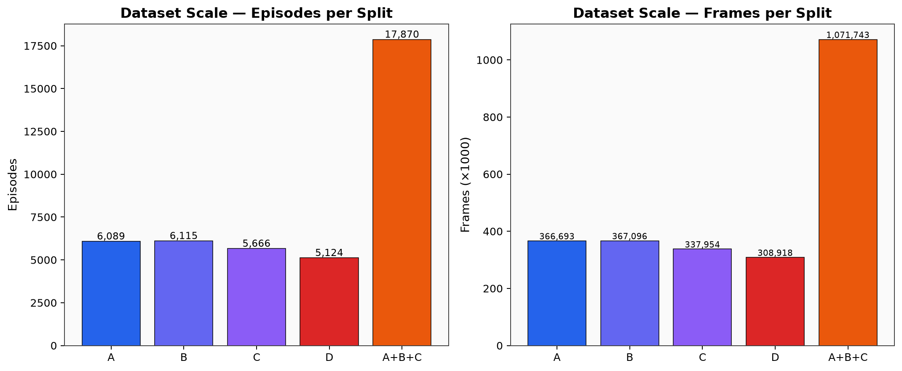
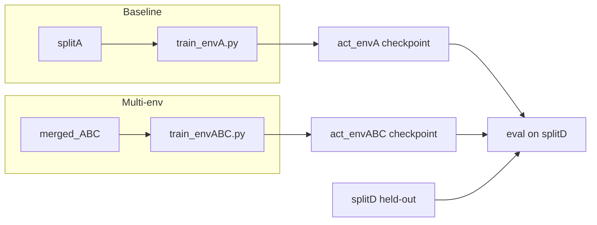

# 02 数据集与预处理

## 2.1 数据划分总览

CALVIN LeRobot 子集按环境分为四个 split，外加合并训练集：

| Split | 目录 | Episodes | Frames | FPS | 在本实验中的角色 |
|-------|------|----------|--------|-----|------------------|
| **A** | `calvin-lerobot/splitA` | 6,089 | 366,693 | 10 | **Baseline 训练**（仅此环境） |
| **B** | `calvin-lerobot/splitB` | 6,115 | 367,096 | 10 | 多环境训练（merged） |
| **C** | `calvin-lerobot/splitC` | 5,666 | 337,954 | 10 | 多环境训练（merged） |
| **D** | `calvin-lerobot/splitD` | 5,124 | 308,918 | 10 | **零样本评估**（训练未见过） |
| **A+B+C** | `work/data/merged_ABC` | 17,870 | 1,071,743 | 10 | **Multi-env 训练** |



> 规模数据亦见 `doc/stats/dataset_summary.csv`。

**说明**：
- A/B/C/D 规模相近（~5k–6k episodes），domain shift 主要来自视觉场景而非样本量差异。
- merged_ABC 约为单 split 的 **3× episodes**，训练时 I/O 与 `Creating dataset` 耗时显著增加（见训练 log）。

---

## 2.2 观测与动作空间

### 2.2.1 视觉

| 键 | 分辨率 | 来源 |
|----|--------|------|
| `observation.images.image` | 200×200×3 | 固定第三人称相机 |
| `observation.images.wrist_image` | 84×84×3 | 眼在手相机 |

训练时 uint8 存储；eval 前转为 float32 ÷255，再经 policy preprocessor 按 dataset stats 归一化。

### 2.2.2 状态与动作

- **State**：机器人 proprio（关节/末端，维度见 dataset `meta/info.json`）
- **Action**：7 维 — `x, y, z, roll, pitch, yaw, gripper`（**归一化空间**，eval L1 在该空间计算）

---

## 2.3 数据合并（A+B+C）

脚本：`code/merge_abc.py`（将 splitA/B/C 合并为 LeRobot v3 数据集）

- 输出：`work/data/merged_ABC`
- `repo_id`：`calvin/mergedABC`
- 合并后 **17,870 episodes**，供 `train_envABC.py` 使用

合并动机：在 **相同 ACT 架构与超参** 下，仅改变训练域组成，隔离「多环境数据」对泛化的影响。

---

## 2.4 Feature 键名归一化

历史上有多个 fix/rename 脚本互相覆盖；**最终权威脚本**为 `code/normalize_keys.py`，将全部 5 个数据集 verify 通过。

**标准键**（禁止再改 parquet/info）：

```
observation.images.image
observation.images.wrist_image
observation.state
action
```

**原因**：LeRobot dataloader 的 `batch_to_transition` 过滤非 `observation.*` 的观测键；错误命名会导致训练 silently 丢字段或 action 键不匹配。

---

## 2.5 Action Chunk 对齐（delta_timestamps）

ACT 需要一次加载 **chunk_size=100** 的 future actions。LeRobot 通过 `delta_timestamps` 指定：

```python
action_ts = [i / fps for i in range(chunk_size)]  # fps=10 → 0.0, 0.1, ..., 9.9 s
delta_timestamps = {
    "observation.images.image": [0.0],
    "observation.images.wrist_image": [0.0],
    "observation.state": [0.0],
    "action": action_ts,
}
```

- 观测只取当前帧（`n_obs_steps=1`）
- 动作为长度 100 的序列，与 ACT 训练目标一致

---

## 2.6 训练/评估数据流



---

## 2.7 本阶段完成的工作（数据侧）

1. 下载/转换 CALVIN → LeRobot 格式（splitA–D）
2. 键名归一化并 verify 全部数据集
3. 合并 A+B+C 为 merged_ABC
4. 确认 merged 与单 split 的 feature schema 一致，保证公平对比
