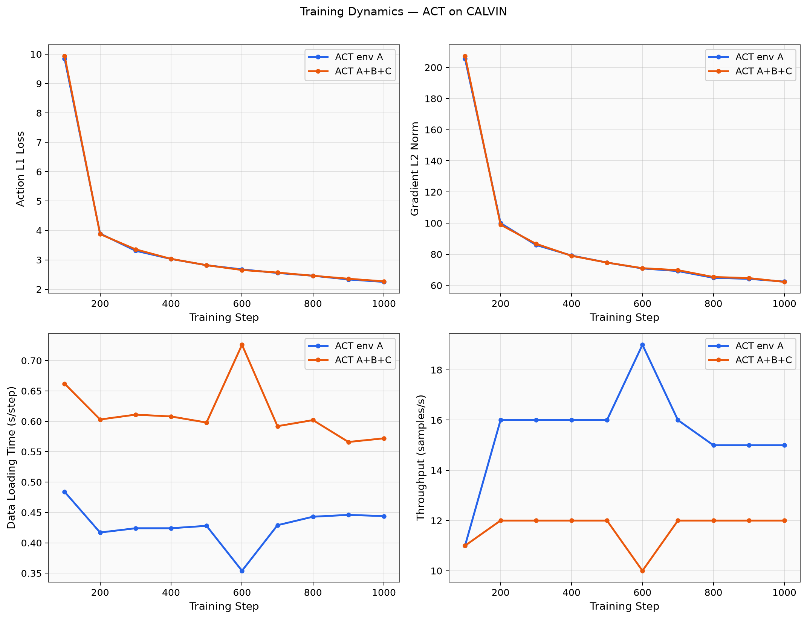

# 04 训练过程分析

## 4.1 训练目标

在两个 checkpoint 上学习归一化 action 的 L1 预测：
- **M1 (env A)**：仅在 domain A 示教上拟合
- **M2 (A+B+C)**：在三个可见 domain 混合数据上拟合

训练 **1000 optimizer steps**（非 epoch 完整遍历）；对 merged 数据而言，1000×8=8000 样本远小于 107 万帧，属 **欠拟合演示预算**。

---

## 4.2 训练动态图表

| 图 | 文件 | 解读 |
|----|------|------|
| 四联图 | `training_dashboard.png` | loss / 梯度 / 数据加载 / 吞吐 |
| Loss | `training_loss_curves.png` | 主优化目标 |
| 梯度 | `training_grad_norm.png` | 稳定性 |
| 数据时间 | `training_data_time.png` | I/O 瓶颈 |
| 吞吐 | `training_throughput.png` | samples/s |

原始数值：`doc/stats/training_log_summary.csv`（由 `analyze_experiments.py` 生成）

---

## 4.3 定量摘要

| 指标 | ACT env A | ACT A+B+C |
|------|-----------|-----------|
| 最终 step | 1000 | 1000 |
| 最终 L1 loss | **2.250** | **2.269** |
| 初始 L1 loss（~step 100） | 9.942 | 9.942 |
| Loss 下降比例 | ~77% | ~77% |
| 平均 grad norm（末期） | ~62 | ~62 |
| 平均 data_s | 0.43s | 0.61s |
| 平均吞吐 | 16 smp/s | 12 smp/s |
| 训练 wall | **9m 03s** | **11m 51s** |
| 含数据加载总 wall | **9m 05s** | **24m 32s** |

详见 [08_timing_and_cost.md](08_timing_and_cost.md)。

---

## 4.4 现象解读

### 4.4.1 Loss 曲线

两模型 loss 均从 ~10 降至 ~2.2，说明 ACT 在 1000 step 内 **已学到有效 action 映射**，但未收敛（loss 仍在缓慢下降）。

envABC 初始与 envA 相同（step 100 处均为 9.942），因 batch 随机性；中后期 envABC 略高 0.02，可能因：
- 混合 domain 提高任务难度；
- 相同 step 预算下见到的 A-domain 专属样本比例更低。

### 4.4.2 梯度

梯度从 ~207（step 100）降至 ~62（step 1000），无 explosion，训练稳定。两模型梯度规模接近，**优化难度相当**。

### 4.4.3 数据加载与吞吐

envABC 的 `data_s` 系统性高于 envA（+40%），吞吐低 ~25%。这不是 GPU 算力差异，而是 **merged 数据集索引/IO** 导致。工程上若做大规模 multi-env 训练，应优先考虑：
- 数据 shard 本地 SSD；
- 减少 `num_workers` 抖动；
- 或 episode 子采样策略。

---

## 4.5 Checkpoint

| Step | envA 路径 | envABC 路径 |
|------|-----------|-------------|
| 500 | `outputs/act_envA/checkpoints/000500/` | `outputs/act_envABC/checkpoints/000500/` |
| 1000 | `.../001000/` 或 `last/` | 同上 |

Step 500 时刻 wall：envA **4m 34s**，envABC **5m 49s**（含各自训练段，不含 envABC 数据集加载）。

---

## 4.6 本节结论（训练侧）

1. 两模型在相同架构下均完成 **有效但欠收敛** 的训练。
2. Multi-env 的主要额外成本在 **数据加载与采样**，而非 forward/backward。
3. 训练 loss 差距小（2.25 vs 2.27），**不能** 直接推断 zero-shot 优劣 — 需看 env D eval。
