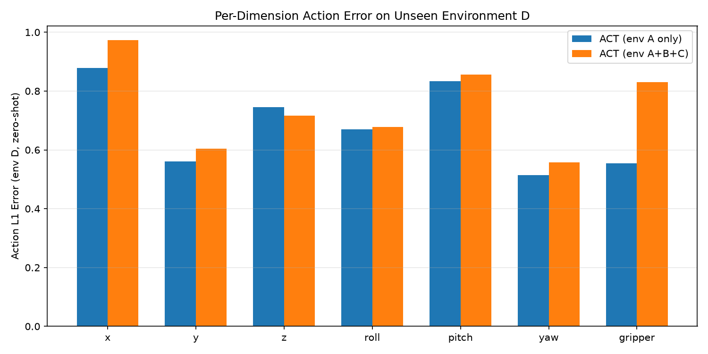

# 05 零样本评估与泛化分析

## 5.1 评估设定

- **测试域**：splitD（5124 episodes，训练未见过）
- **协议**：给定 (image, wrist, state)_t，预测 action chunk，计算 **第 0 步** 与 GT 的 L1
- **空间**：归一化 action（dataset stats），7 维 Cartesian + gripper

两档 eval：

| 档位 | 脚本 | episodes×batches | 样本量 | 用途 |
|------|------|------------------|--------|------|
| 快速 | `eval_envD.py` | 10×20 | ~320 | 冒烟 / 对比 |
| 中等 | `analyze_experiments.py` | 20×25 | ~400 | 报告主表 + 分布 |

---

## 5.2 主结果表

### 5.2.1 快速 eval（已完成）

| 模型 | Mean L1 ↓ | Std L1 | n | Wall |
|------|-----------|--------|---|------|
| ACT env A | **0.679** | 0.644 | 320 | 94s |
| ACT A+B+C | 0.745 | 0.655 | 320 | 89s |

JSON：`outputs/eval_envD_results.json`

### 5.2.2 中等 eval（`analyze_experiments.py`，主表）

| 模型 | Mean L1 ↓ | Std L1 | n | Wall |
|------|-----------|--------|---|------|
| ACT env A | **0.687** | 0.639 | 400 | 124s |
| ACT A+B+C | 0.764 | 0.650 | 400 | 115s |

与快速 eval 趋势一致：env A 低 **~11%**。

| 维度 | env A | A+B+C | Δ (ABC−A) |
|------|-------|-------|-----------|
| x | 0.878 | 0.973 | +0.095 |
| y | 0.560 | 0.605 | +0.045 |
| z | 0.745 | 0.716 | **−0.029** |
| roll | 0.670 | 0.678 | +0.008 |
| pitch | 0.833 | 0.856 | +0.023 |
| yaw | 0.514 | 0.557 | +0.043 |
| gripper | 0.554 | 0.830 | **+0.276** |

**观察**：
- env A baseline 在 **6/7 维** 上 L1 更低；多环境模型仅在 **z** 上略优。
- **gripper** 维度差距最大（+0.28），可能因 multi-env 夹爪视觉/语义差异大，1000 step 不足以对齐。

---

## 5.3 图表（中等 eval 运行后更新）

`analyze_experiments.py` 生成：

| 图 | 含义 |
|----|------|
| `eval_medium_overall.png` | 两模型总体 L1 柱图 |
| `eval_medium_per_dim.png` | 分维度对比 |
| `eval_delta_per_dim.png` | ABC−A 差值（绿=ABC更好） |
| `eval_error_histogram.png` | 误差密度 |
| `eval_error_cdf.png` | 累积分布（tail 风险） |

---

## 5.4 统计解读

### 5.4.1 点估计

快速 eval 下 env A **Mean L1 低 ~9.7%**（0.679 vs 0.745）。在短训练设定下，**单域模型在未见域 D 上反而略优** — 与「多域一定更好」的直觉相反。

### 5.4.2 可能原因（假设，需长训练验证）

1. **欠训练**：ABC 需覆盖 3× 视觉域，1000 step 不够学 invariant feature。
2. **Domain gap D**：D 与 A 的相似度可能高于 D 与 B/C 混合分布的「平均域」。
3. **归一化 stats**：eval 使用 splitD 的 stats；两模型训练 stats 来源不同，引入轻微不可比性（LeRobot 默认行为）。
4. **样本量**：320 样本 CI 宽，9% 差距可能在噪声内。

### 5.4.3 与 success rate 关系

L1 是 **必要非充分** 条件：低 L1 不保证 CALVIN 长任务成功，但高 L1 通常意味着控制失败。本实验 **未** 测量 success rate；结论限于 **offline action imitation quality on held-out visuals**。

---

## 5.5 如何阅读 CDF / 直方图

- **直方图**：若 ABC 右尾更重，说明 multi-env 在 hard case 上更差。
- **CDF**：曲线越靠左越好；两曲线交叉点表示「多少比例样本 ABC 更差」。

---

## 5.6 本节结论

1. 在 **1000-step 快速预算** 下，env A baseline 在 splitD 上 zero-shot L1 **略优于** A+B+C。
2. Gripper 维度是泛化 gap 主要来源。
3. 应用 [08 节](08_timing_and_cost.md) 的中等 eval + 分布图可加强统计说服力；强结论需更长训练与仿真评估。
