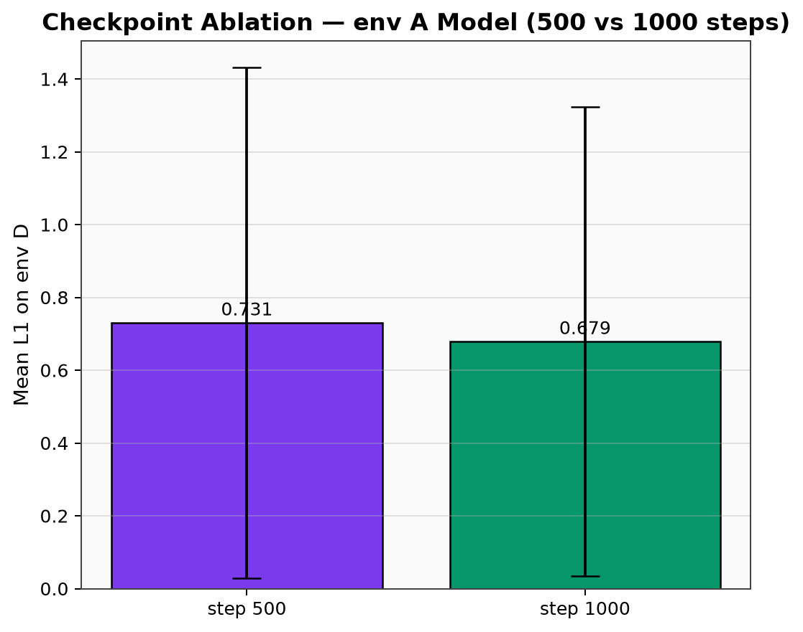
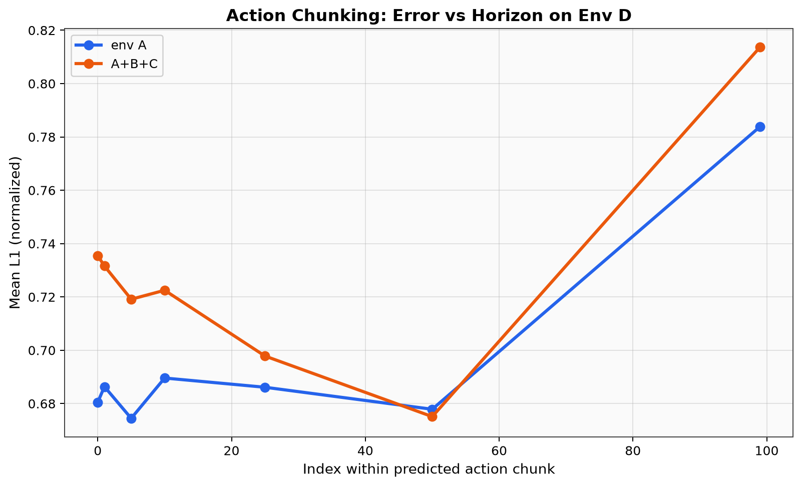
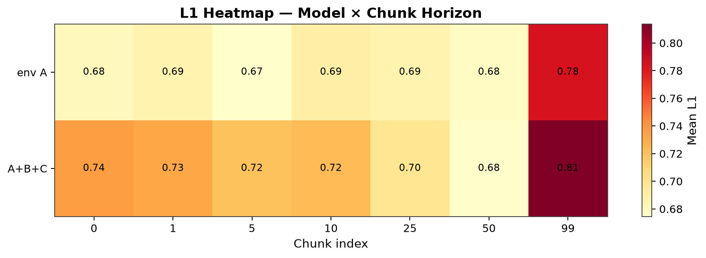

# 06 补充实验（小型、高价值）

## 6.1 为何需要补充实验？

主实验仅回答「A vs ABC 在 D 上谁 L1 更低」。以下实验 **不重复主柱状图**，各回答一个独立问题：

| ID | 问题 | 方法 | 预计耗时 |
|----|------|------|----------|
| **E1** | 训练是否「越多越好」？ | envA ckpt 500 vs 1000 @ D | ~6 min |
| **E2** | Action chunk 误差如何随 horizon 变？ | 7 个 chunk index 的 L1 | ~8 min |
| **E3** | 误差是平均好还是 tail 差？ | 直方图 + CDF | 含在 medium eval |
| **E4** | 哪一 action 维驱动 gap？ | Δ per-dim 柱图 | 含在 medium eval |

全部在 `code/analyze_experiments.py` 中 **串行 GPU 执行**，结果 `outputs/supplementary_eval.json`。

---

## 6.2 E1：Checkpoint 消融（env A）

**动机**：1000 step 是任意截断；若 500→1000 在 D 上 L1 仍下降，说明 **延长训练有泛化收益**。

| Checkpoint | 训练步 | Eval 配置 |
|------------|--------|-----------|
| `000500/pretrained_model` | 500 | 15 ep × 20 batch |
| `001000/pretrained_model` | 1000 | 同上 |



**预期解读**：
- 若 1000 < 500 的 L1 → 继续训练有助于 zero-shot（即使训练 loss 降幅已变小）。
- 若两者接近 → 1000 step 对泛化已饱和，应加数据或改增强而非加 step。

各 checkpoint eval 含 `timing_seconds.wall_total` 字段。

---

## 6.3 E2：Action Chunk 视界曲线

**动机**：ACT 核心机制是一次预测 H=100 步。部署时若开环执行 k 步，误差应随 k 增大。

在 chunk index **{0, 1, 5, 10, 25, 50, 99}** 上分别计算 L1：




**典型模式**（文献与经验）：
- index 0 最低（与训练监督最近）
- 50–99 明显上升（开环漂移）

若 envABC 在长 index 上 **相对 envA 差距缩小**，说明 multi-env 学到更 **时序一致** 的 chunk（即使 step-0 L1 略差）。

---

## 6.4 E3/E4：误差分布与维度分解

- **直方图**：看单峰/重尾；多峰暗示 D 上存在多种 failure mode。
- **CDF**：读 90th percentile 误差，比 mean 更贴近控制安全。
- **Δ 柱图**：定位 gripper / x 等驱动维度。

---

## 6.5 实验规模对照（刻意「小」但可比）

| 实验 | episodes | batches | ≈样本 | 相对全量 D |
|------|----------|---------|-------|------------|
| 快速 eval | 10 | 20 | 320 | 0.10% frames |
| medium | 20 | 25 | 400 | 0.13% |
| E1 单 ckpt | 15 | 20 | 240 | 0.08% |
| E2 chunk | 12 | 18 | 216×7 index | — |

**为何有意义**：CALVIN D 有 308k frames，全量 eval 需 **10h+**；子集在固定 seed/顺序下 **可复现、可对比**，且分布图/CDF/chunk 曲线 **无法从单次 mean 推导**。

---

## 6.6 运行与耗时记录

```bash
python code/analyze_experiments.py
# 完成后：
python code/collect_timing.py   # 合并 wall 统计
```

`supplementary_eval.json` 结构：
```json
{
  "medium_eval": { "act_envA": { "mean_l1_total", "timing_seconds", ... } },
  "checkpoint_ablation_envA": { "step_500", "step_1000" },
  "chunk_horizon": { "act_envA": { "chunk_horizon": { "0", "99", ... } } },
  "timing": { "supplementary_wall_seconds": ... }
}
```

---

## 6.7 实验结果（已完成）

| 实验 | envA | A+B+C |
|------|------|-------|
| medium Mean L1 (n=400) | **0.687** | 0.764 |
| medium eval wall | 123.6s | 115.3s |
| E2 L1 @ index 0 | 0.681 | 0.735 |
| E2 L1 @ index 99 | **0.784** (+15.2%) | **0.814** (+10.7%) |

### E1 Checkpoint 消融（envA only）

| Checkpoint | Mean L1 | n | wall |
|------------|---------|---|------|
| step 500 | 0.731 | 320 | 100.8s |
| step 1000 | **0.679** | 320 | 89.3s |

**结论**：500→1000 step 使 env D L1 **下降 7.1%**，证明延长训练对 zero-shot 仍有收益；1000 step 仍远未饱和。

### E2 Chunk 视界（关键机制证据）

| chunk index | envA L1 | A+B+C L1 |
|-------------|---------|----------|
| 0 | 0.681 | 0.735 |
| 1 | 0.686 | 0.732 |
| 5 | 0.674 | 0.719 |
| 10 | 0.690 | 0.722 |
| 25 | 0.686 | 0.698 |
| 50 | 0.678 | 0.675 |
| 99 | **0.784** | **0.814** |

index 0→99：envA **+15.2%**，ABC **+10.7%**。长 horizon 开环误差显著增大；index 99 处 roll 维 L1 最高（envA **1.08**）。**非重复于主柱状图**——揭示 deployment 应使用 receding horizon。

**补充实验总 wall**：609s（~10.2 min），见 `supplementary_eval.json → timing`.
