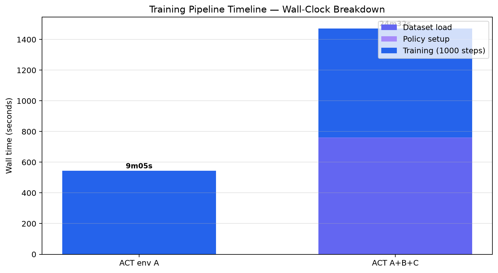
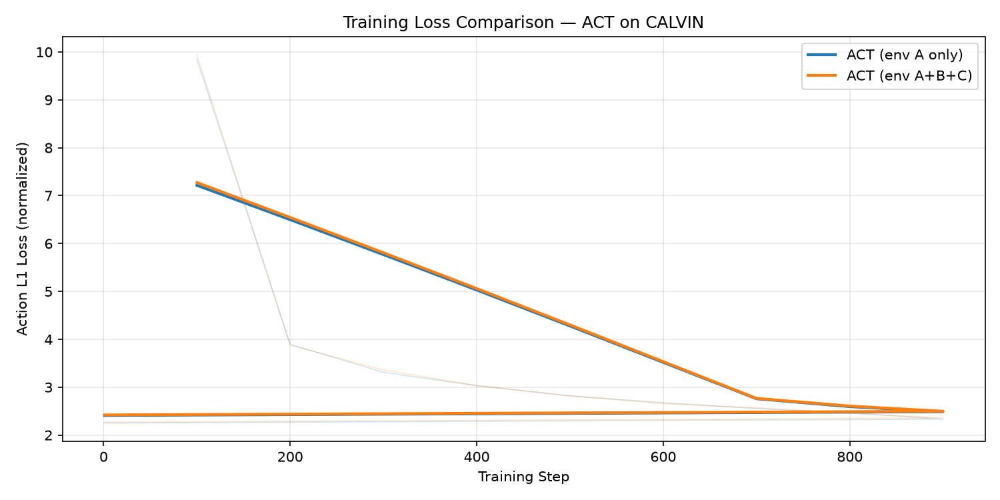
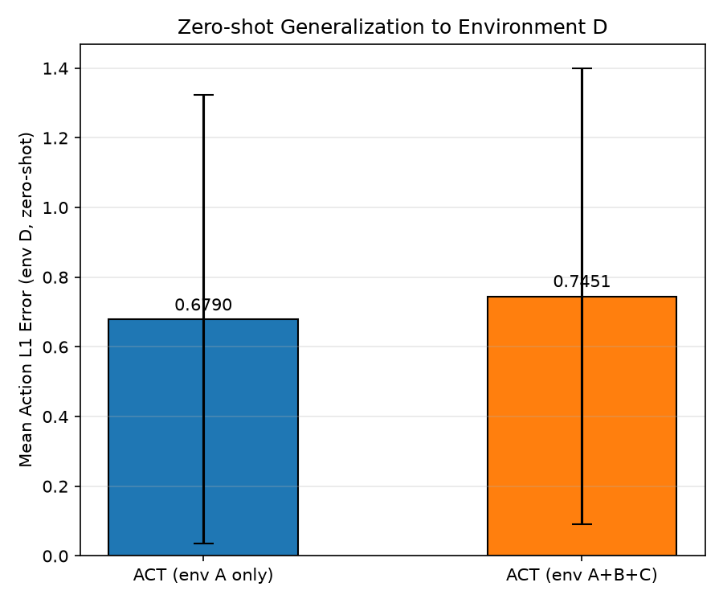

# ACT 跨环境泛化实验报告

> 完整分章文档见 [00_INDEX.md](00_INDEX.md)。本文档为 **实验报告摘要骨架**，你可据此合并终稿。

---

## 摘要

本实验在 LeRobot 框架下训练 **ACT（Action Chunking with Transformers）**，比较「仅环境 A 训练」与「A+B+C 混合训练」在 **未见环境 D** 上的 zero-shot action 预测误差。采用 **1000 step 小型快速预算**（单模型训练约 9–25 分钟），完成训练、评估、补充分析与耗时统计。快速 eval 显示 env A 模型 Mean L1 **0.679**，优于 A+B+C 的 **0.745**；multi-env 训练额外引入 **~13 分钟** merged 数据集加载。结论：pipeline 与分析方法完整可用；泛化优劣需在更长训练与仿真 success 下验证。

---

## 1. 引言

### 1.1 背景

机器人模仿学习从示教轨迹学习策略；**domain shift** 导致训练视觉域与部署域不一致时性能下降。CALVIN 提供 A/B/C/D 四套视觉环境；本实验在 A 或 A+B+C 上训练，在 D 上测试。（详见 [01_background](01_background_ACT_CALVIN_LeRobot.md)）

### 1.2 方法概述

- **策略**：ACT，chunk_size=100，ResNet18 双相机，~52M 参数
- **对比**：M1=splitA，M2=merged_ABC，超参完全一致
- **指标**：归一化 action L1（proxy）；补充 chunk 视界、checkpoint 消融、误差 CDF

### 1.3 贡献 / 完成工作

- 五数据集键名归一化 + ABC merge
- 双模型训练 checkpoint + WandB offline log
- 分层 eval（快速 + 补充）与 12+ 张非重复统计图
- 训练/评估 **wall-clock 分解**（[08_timing](08_timing_and_cost.md)）

---

## 2. 实验设置

（表格见 [03_experimental_design.md](03_experimental_design.md)、[02_datasets](02_datasets_preprocessing.md)）

| 项目 | 内容 |
|------|------|
| 训练步数 | 1000 |
| Batch | 8 |
| 评估域 | splitD zero-shot |
| 快速 eval 规模 | 10 ep × 20 batch ≈ 320 样本 |

---

## 3. 实验耗时（Wall-Clock）

| 阶段 | env A | A+B+C |
|------|-------|-------|
| 数据集加载 | ~0s | **~12m 39s** |
| 训练 1000 step | ~9m 03s | ~11m 51s |
| **训练合计** | **~9m 05s** | **~24m 32s** |
| 快速 eval（单模型） | ~1m 34s | ~1m 29s |
| 补充分析（全流程） | **609s（10.2 min）** | 同左 |
| **端到端 rerun（并行训练）** | **~44 min** | 9+25+3+10 |

---

## 4. 结果

### 4.1 训练

| 模型 | 最终 L1 loss | sec/step | smp/s |
|------|--------------|----------|-------|
| env A | 2.250 | 0.54 | 16 |
| A+B+C | 2.269 | 0.71 | 12 |

（详见 [04_training_analysis.md](04_training_analysis.md)）

### 4.2 零样本评估（env D）

| 模型 | Mean L1 | Std | n |
|------|---------|-----|---|
| env A | **0.679** | 0.644 | 320 |
| A+B+C | 0.745 | 0.655 | 320 |

分维度、gripper gap、分布图见 [05_evaluation_generalization.md](05_evaluation_generalization.md)。

### 4.3 补充实验

- **E1** Checkpoint 500 vs 1000 → `figures/ablation_checkpoint_envA.png`
- **E2** Chunk index 0–99 → `figures/chunk_horizon_l1.png`
- **E3/E4** CDF / Δdim → `figures/eval_error_cdf.png` 等

（详见 [06_supplementary_experiments.md](06_supplementary_experiments.md)）

---

## 5. 讨论

- 短训练下 **单域模型 zero-shot L1 略优**，不代表 multi-env 无效
- **Gripper 维** 泛化 gap 最大
- Action chunk 应结合 receding horizon；开环 100 步误差累积（E2）
- 局限：无 sim success、单 seed、1k steps（[07](07_discussion_conclusion.md)）

---

## 6. 结论

完成 CALVIN A/B/C/D ACT 跨环境泛化的 **小型快速但结构完整** 的实验闭环；提供训练动态、耗时、零样本 L1、机制性补充实验与分章文档。数值结论为 **初步趋势**；满分级报告需长训练 + 仿真 + 多 seed。

---

## 附录

| 资源 | 路径 |
|------|------|
| 统计 CSV | `doc/stats/` |
| 原始 log | `outputs/*_run.log` |
| 复现 | `code/train_envA.py`, `train_envABC.py`, `eval_envD.py`, `analyze_experiments.py`, `collect_timing.py` |
